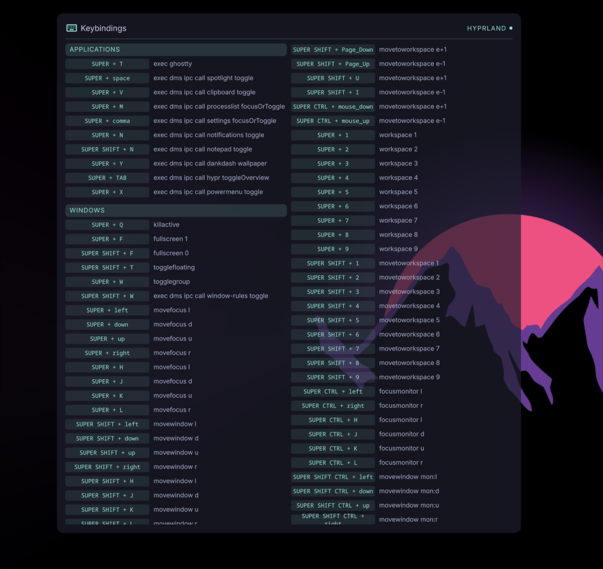

# Keybinding Cheat Sheet

A [DankMaterialShell](https://danklinux.com/docs/dankmaterialshell) desktop widget that parses your compositor's keybinding config and displays them as a live, filterable cheat sheet.

Supports **Hyprland**, **MangoWC**, **Sway**, and **Niri**.



---

## Features

- Parses keybindings directly from your compositor config — nothing is hardcoded
- Sections defined by annotations in your config; everything else is ignored
- Show/hide individual sections from the settings panel
- Follows `source`/`include` directives to pick up bindings from sub-configs
- Supports additional config files via settings (e.g. separate binds files)
- `@ignore` blocks let you exclude bindings you don't want shown

---

## Installation

1. Copy or symlink this directory into your DMS plugins folder:

   ```bash
   ln -s ~/path/to/dank-keybinding-cheat-sheet \
         ~/.config/DankMaterialShell/plugins/KeybindingCheatSheet
   ```

2. Open DMS Settings → Plugins, scan for plugins, and enable **Keybinding Cheat Sheet**.

3. Add the widget to your desktop.

---

## Annotating Your Config

The parser only picks up bindings inside explicitly marked sections. Add `# @section` comments to your config to define them:

### Hyprland / MangoWC / Sway

```bash
# @section Applications
bind = $mainMod, Return, exec, alacritty
bind = $mainMod, B, exec, firefox

# @section Window Management
bind = $mainMod, Q, killactive,
bind = $mainMod, F, fullscreen, 0
```

### Niri

```kdl
binds {
    // @section Applications
    Mod+Return { spawn "alacritty"; }
    Mod+B { spawn "firefox"; }

    // @section Window Management
    Mod+Q { close-window; }
}
```

Plain comments are ignored — only `# @section` (or `// @section` for niri) triggers a new section.

### Ignoring bindings

Wrap any bindings you don't want shown in the widget with `@ignore` / `@end-ignore`:

```bash
# @section Applications
bind = $mainMod, Return, exec, alacritty

# @ignore
bind = $mainMod, X, exec, internal-debug-tool
# @end-ignore
```

---

## Settings

| Setting | Description |
|---|---|
| **Compositor** | Which compositor config format to parse |
| **Config path** | Path to your main config file. Leave empty to use the default location |
| **Additional files** | Comma-separated extra files to parse (e.g. a dedicated binds sub-config) |
| **Sections** | Toggle individual sections on/off in the widget |

### Default config paths

| Compositor | Default path |
|---|---|
| Hyprland | `~/.config/hypr/hyprland.conf` |
| MangoWC | `~/.config/mango/config.conf` |
| Sway | `~/.config/sway/config` |
| Niri | `~/.config/niri/config.kdl` |

---

## How It Works

The widget calls `parse-keybindings.sh` via a Quickshell `Process` at startup and whenever settings change. The script:

1. Reads the config file(s)
2. Resolves variables (`$mainMod`, `$mod`, etc.)
3. Follows `source`/`include` directives recursively
4. Collects bindings under `# @section` markers
5. Outputs a JSON object: `{ "sections": [ { "id", "name", "bindings": [...] } ] }`

The QML widget parses that JSON and renders it. Hidden sections are stored in plugin settings and filtered client-side.

### Running the parser directly

```bash
./parse-keybindings.sh hyprland
./parse-keybindings.sh sway ~/.config/sway/config
./parse-keybindings.sh hyprland "" "~/.config/hypr/extra.conf,~/.config/hypr/media.conf"
```

---

## Tests

```bash
bash tests/test_parsers.sh
bash tests/test_parsers.sh --verbose
```

---

## License

Public domain — see [LICENSE](LICENSE). Do whatever you want with it.
